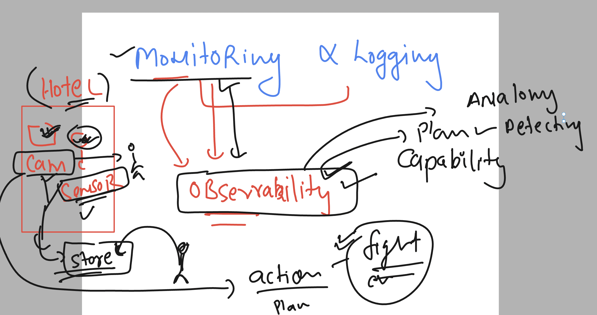
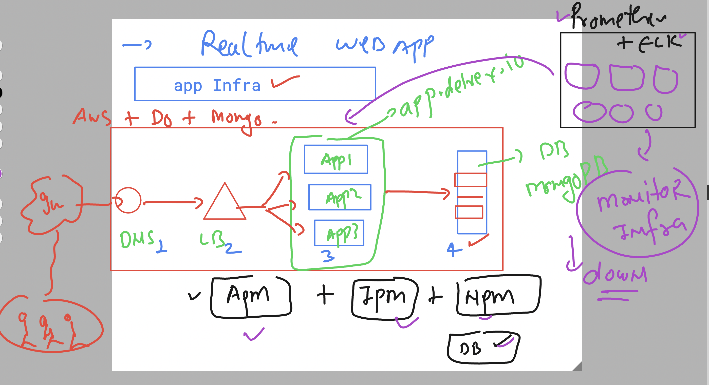
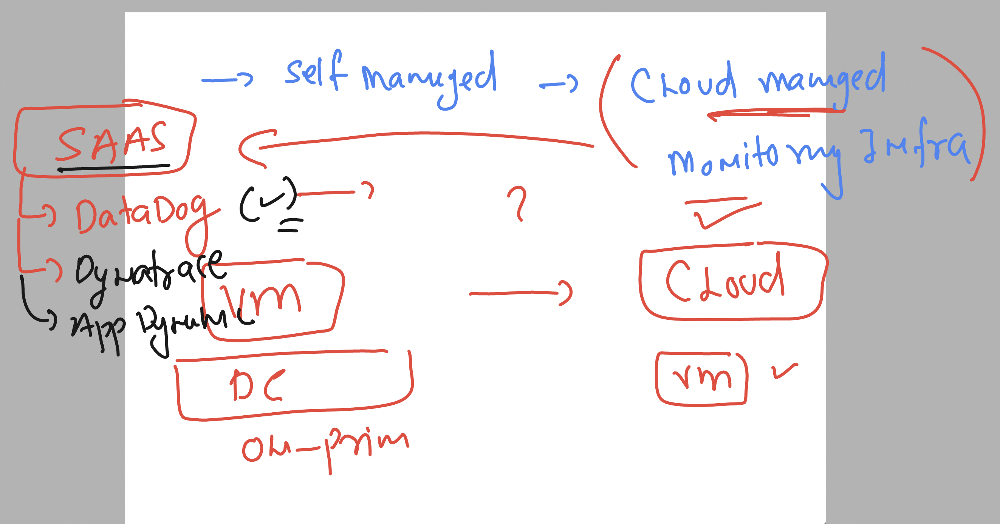
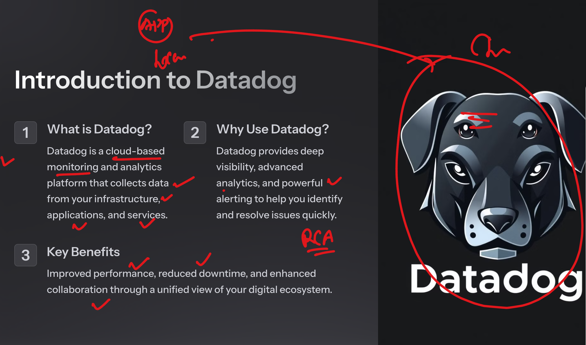
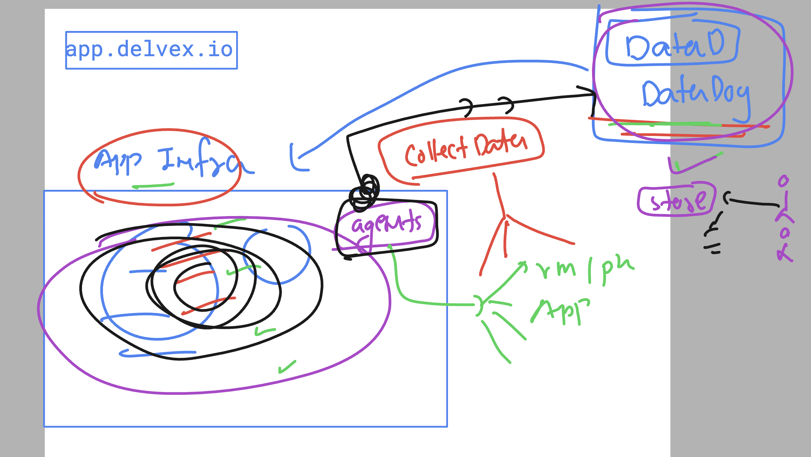
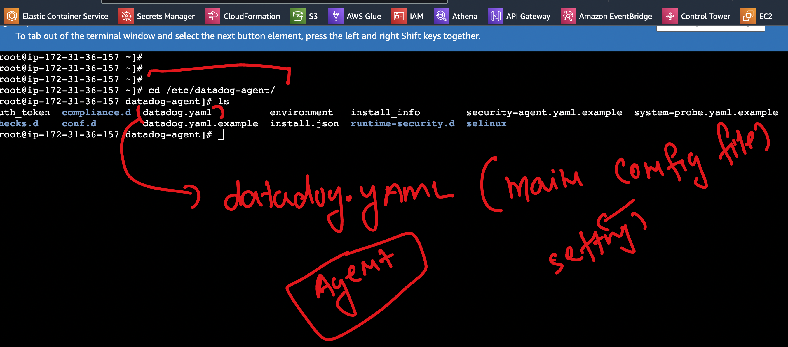
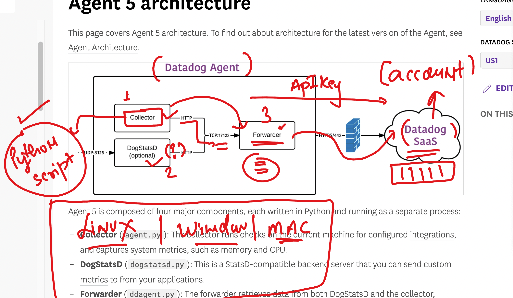
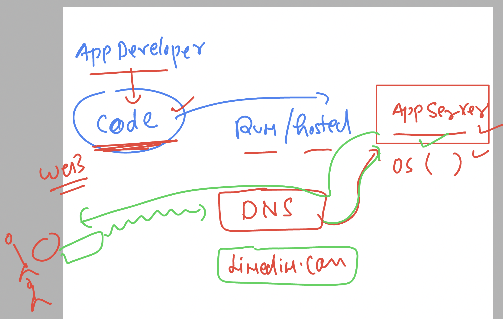

## Monitoring --> Observability 



## Problem with Going to self managed Monitoring stack 



## Intro to SAAS (software as a service ) based Monitoring solutions 



### Introduction to datadog 



### datadog agent 



### official web link of datadog for account creation / docs 

[click_here](https://www.datadoghq.com/)


### datadog agent -- more info 


## dealing with Remote Linux server 

### some basic commands 

```
[ec2-user@ip-172-31-36-157 ~]$ whoami
ec2-user

```

### login to root / admin user 

```
[ec2-user@ip-172-31-36-157 ~]$ sudo -i 
[root@ip-172-31-36-157 ~]# 
[root@ip-172-31-36-157 ~]# whoami
root
[root@ip-172-31-36-157 ~]# 

```

### Installing datadog agent v7 on linux machine 

```
[root@ip-172-31-36-157 ~]# dnf install -y libxcrypt-compat

Last metadata expiration check: 0:32:36 ago on Mon Oct 14 14:06:07 2024.
Dependencies resolved.
===========================================================================================================================================
 Package                             Architecture              Version                                Repository                      Size
===========================================================================================================================================
Installing:
 libxcrypt-compat                    x86_64                    4.4.33-7.amzn2023                      amazonlinux                     92 k

Transaction Summary

```

### installing agent 

```
DD_API_KEY="past-your-key-here" \
DD_SITE="us5.datadoghq.com" \
bash -c "$(curl -L https://install.datadoghq.com/scripts/install_script_agent7.sh)"
```

### verify installation  and check datadog agent service 



### checking config file 

```
 cd /etc/datadog-agent/
[root@ip-172-31-36-157 datadog-agent]# 

[root@ip-172-31-36-157 datadog-agent]# ls
auth_token  compliance.d  datadog.yaml          environment   install_info        security-agent.yaml.example  system-probe.yaml.example
checks.d    conf.d        datadog.yaml.example  install.json  runtime-security.d  selinux
[root@ip-172-31-36-157 datadog-agent]# 


```

### status of agent 

```
systemctl   status  datadog-agent 


● datadog-agent.service - Datadog Agent
     Loaded: loaded (/usr/lib/systemd/system/datadog-agent.service; enabled; preset: disabled)
     Active: active (running) since Mon 2024-10-14 14:43:32 UTC; 27min ago
   Main PID: 4408 (agent)
      Tasks: 8 (limit: 4658)
     Memory: 116.6M
        CPU: 15.833s
```

### more datadog agent status management commands 

```
11  systemctl   stop   datadog-agent 
   12  systemctl   status  datadog-agent 
   13  systemctl   start  datadog-agent 
   14  systemctl   status  datadog-agent 
```

### we can check hostname of machine 

```
hostname
ip-172-31-36-157.ap-south-1.compute.internal

```

### datadog agent and its components 



## datadog command any os can use it 

```
datadog-agent  --help 

The Datadog Agent faithfully collects events and metrics and brings them
to Datadog on your behalf so that you can do something useful with your
monitoring and performance data.

Usage:
  datadog-agent [command]

Available Commands:
  check                 Run the specified check
  completion            Generate the autocompletion script for the specified shell
  config                Print the runtime configuration of a running agent
  configcheck           Print all configurations loaded & resolved of a running agent
  diagnose              Validate Agent installation, configuration and environment
  dogstatsd             Inspect dogstatsd pipeline status
  dogstatsd-capture     Start a dogstatsd UDS traffic capture

```

### hostname 

```
datadog-agent  hostname
ip-172-31-36-157.ap-south-1.compute.internal
[root@ip-172-31-36-157 datadog-agent]# 
```

### status 

```
 datadog-agent  status 
Getting the status from the agent.

===============
Agent (v7.57.2)
===============
  Status date: 2024-10-14 15:37:26.857 UTC (1728920246857)
  Agent start: 2024-10-14 15:14:32.403 UTC (1728918872403)
  Pid: 9584
  Go Version: go1.22.7
  Python Version: 3.11.8
  Build arch: amd64
  Agent flavor: agent
  Log Level: info

  Paths
  =====
    Config File: /etc/datadog-agent/datadog.yaml
    conf.d: /etc/datadog-agent/conf.d
    checks.d: /etc/datadog-agent/checks.d
```

### app Server 



