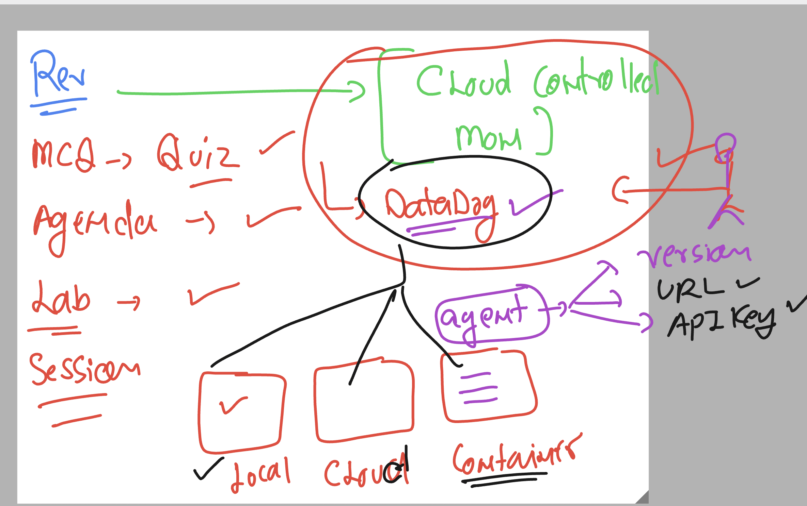

### revision 



### login to linux machine 

### checking current user 

```
[ec2-user@ip-172-31-36-157 ~]$ whoami
ec2-user
[ec2-user@ip-172-31-36-157 ~]$ 


===> switch to root / admin user 

 sudo -i
[root@ip-172-31-36-157 ~]# whoami
root
```

### checking datadog status 

```
systemctl  status datadog-agent
● datadog-agent.service - Datadog Agent
     Loaded: loaded (/usr/lib/systemd/system/datadog-agent.service; enabled; preset: disabled)
     Active: active (running) since Tue 2024-10-15 12:39:45 UTC; 6min ago
   Main PID: 2080 (agent)
      Tasks: 9 (limit: 4658)
     Memory: 271.0M
```

### in datadog v5/v6 to make agent auto start on boot 

```
systemctl  enable  datadog-agent
```

### datadog-agent commands 

```
 datadog-agent  status 
Getting the status from the agent.

===============
Agent (v7.57.2)
===============
  Status date: 2024-10-15 12:49:04.336 UTC (1728996544336)
  Agent start: 2024-10-15 12:39:48.373 UTC (1728995988373)
  Pid: 2080
  Go Version: go1.22.7
  Python Version: 3.11.8
  Build arch: amd64
  Agent flavor: agent
  Log Level: info

  Paths
  =====
    Config File: /etc/datadog-agent/datadog.yaml
    conf.d: /etc/datadog-agent/conf.d
    checks.d: /etc/datadog-agent/checks.d

```
### version check 

```
datadog-agent  version 
Agent 7.57.2 - Commit: 38ba0c7 - Serialization version: v5.0.130 - Go version: go1.22.7
[root@ip-172-31-36-157 ~]# 
```

### datadog account change 


## Process in OS 


### changing in datadog.yaml file to enable live process monitoring 

```
nano  /etc/datadog-agent/datadog.yaml

# adding lines 

##############
#### My additional config details 
process_config:
  process_collection:
    enabled: true
```

### do a configtest 

```
 datadog-agent  configcheck 
```
### restart service of agent 

```
systemctl restart datadog-agent

===>
systemctl status  datadog-agent
● datadog-agent.service - Datadog Agent
     Loaded: loaded (/usr/lib/systemd/system/datadog-agent.service; enabled; preset: disabled)
     Active: active (running) since Tue 2024-10-15 14:39:20 UTC; 20s ago
   Main PID: 23002 (agent)
      Tasks: 8 (limit: 4658)
     Memory: 93.0M
```