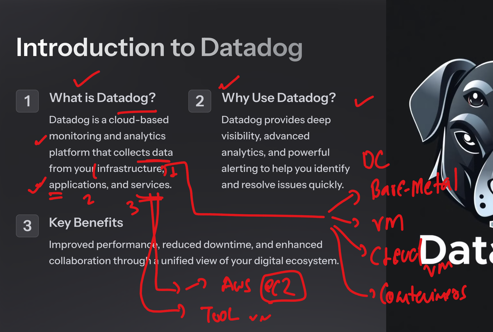
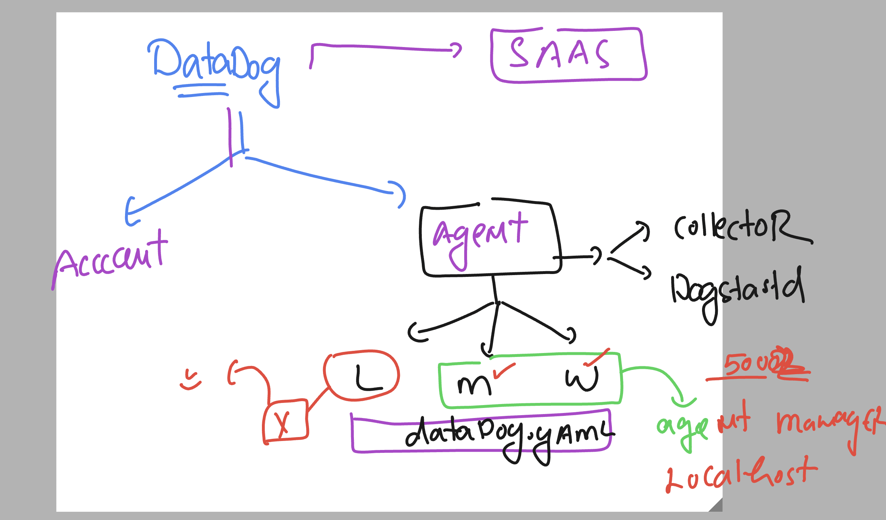
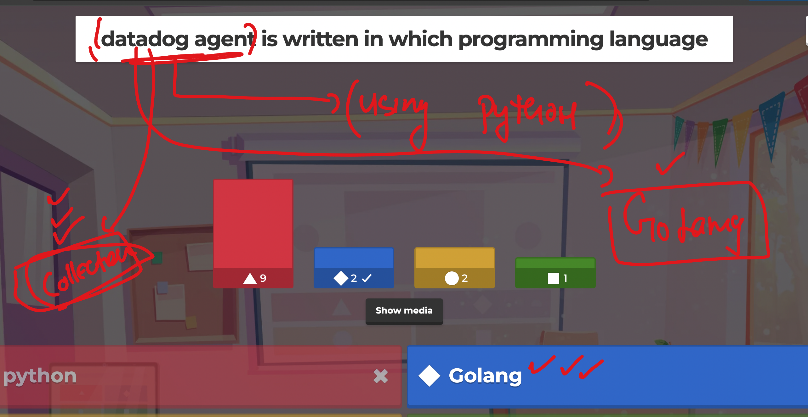
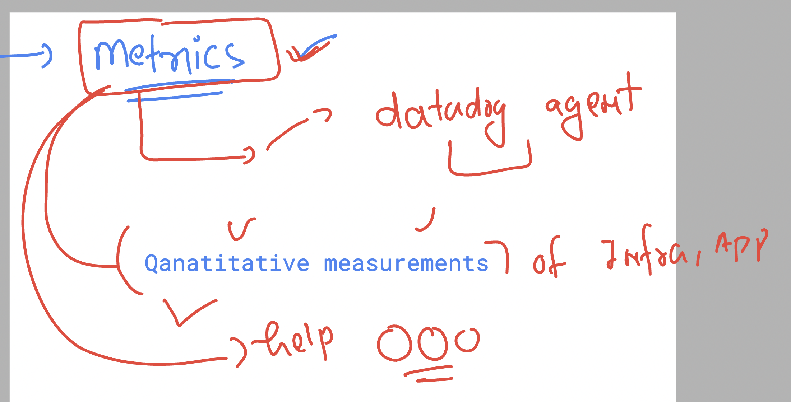
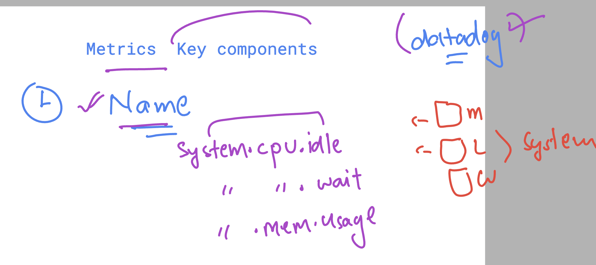
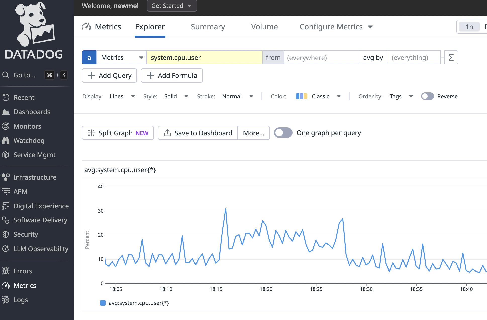
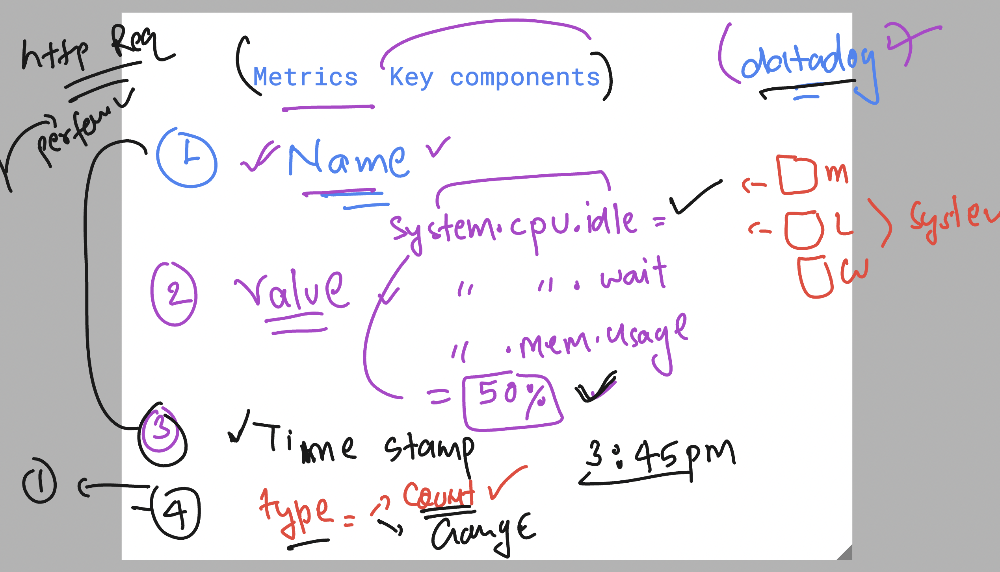
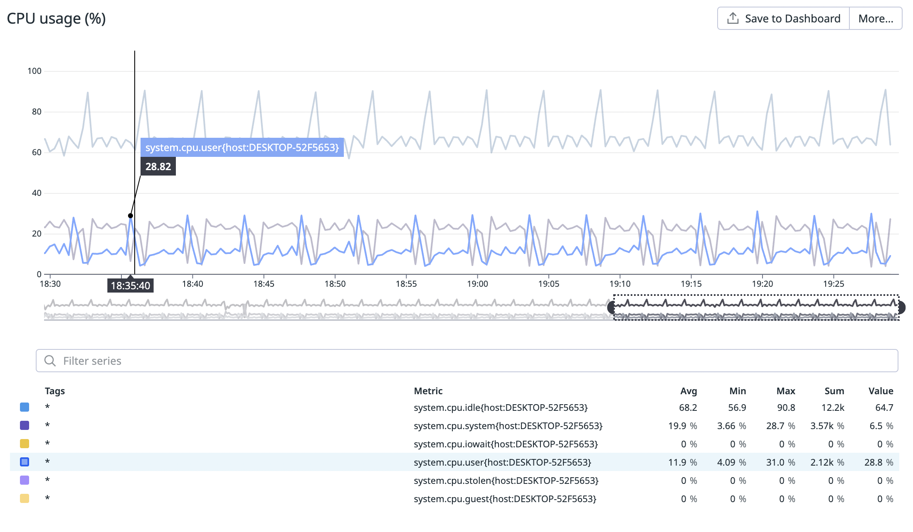

## Revision 

## datadog info 



### datadog agent info 



### datadog agent -- GOlang vs Python 



## datadog sit URL 


[click_here](https://docs.datadoghq.com/getting_started/site/)

### verify datadog agent ON linux machine 

```
whoami
ec2-user
[ec2-user@ip-172-31-36-157 ~]$ sudo -i
[root@ip-172-31-36-157 ~]# whoami
root
[root@ip-172-31-36-157 ~]# 


====>
 systemctl status datadog-agent
● datadog-agent.service - Datadog Agent
     Loaded: loaded (/usr/lib/systemd/system/datadog-agent.service; enabled; preset: disabled)
     Active: active (running) since Wed 2024-10-16 12:58:30 UTC; 3min 16s ago
   Main PID: 2081 (agent)
```

### by Default hostname of machine (linux|mac|windows)

```
hostname
ip-172-31-36-157.ap-south-1.compute.internal
[root@ip-172-31-36-157 ~]# 
```

## Metrics info 



### name of metrics in Datadog 



### metrics name info 



### overall metrics info 



### default 6 cpu metrics in datadog agent



