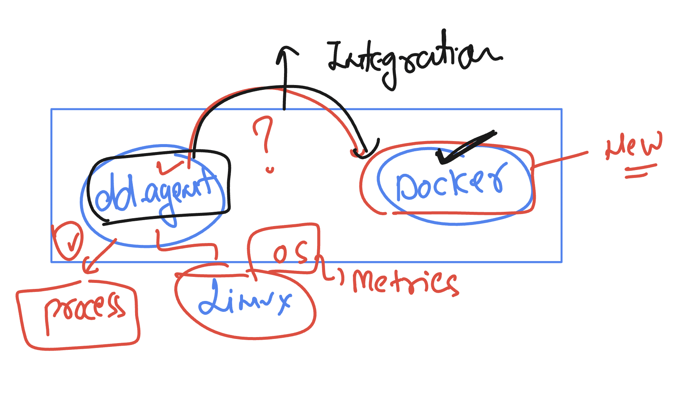
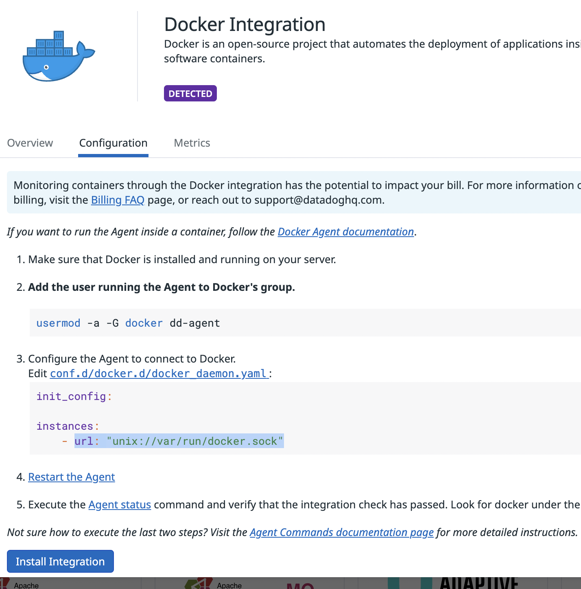
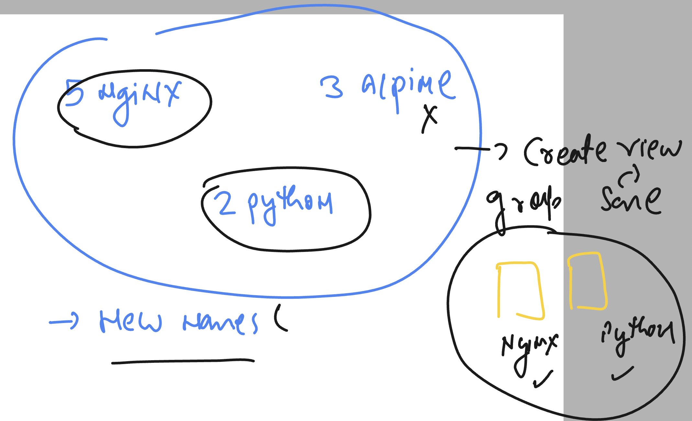

### datadog data collection and retention periods in data types 


### datadog agent is module based system 


### checking datadog status in linux infra 

```
ec2-user@ip-172-31-36-157 ~]$ whoami
ec2-user
[ec2-user@ip-172-31-36-157 ~]$ 
[ec2-user@ip-172-31-36-157 ~]$ sudo -i
[root@ip-172-31-36-157 ~]# whoami
root
[root@ip-172-31-36-157 ~]# systemctl status datadog-agent
● datadog-agent.service - Datadog Agent
     Loaded: loaded (/usr/lib/systemd/system/datadog-agent.service; enabled; preset: disabled)
     Active: active (running) since Thu 2024-10-17 12:46:41 UTC; 1min 38s ago
   Main PID: 2067 (agent)
      Tasks: 8 (limit: 4658)

```

### datadog agent Host infra -- default components 


### INstalling docker in linux vm 

```
yum install docker -y 

===> 
systemctl  start docker 
systemctl  status docker 

```

### Creating 2 webapp containers 

```
docker run -itd --name ashuwebapp2 -p 1235:80 nginx 
docker run -itd --name ashuwebapp1 -p 1234:80 nginx 

===>
docker ps
CONTAINER ID   IMAGE     COMMAND                  CREATED              STATUS              PORTS                                   NAMES
d5648f1fde47   nginx     "/docker-entrypoint.…"   48 seconds ago       Up 47 seconds       0.0.0.0:1235->80/tcp, :::1235->80/tcp   ashuwebapp2
6076b4ec3892   nginx     "/docker-entrypoint.…"   About a minute ago   Up About a minute   0.0.0.0:1234->80/tcp, :::1234->80/tcp   ashuwebapp1
[root@ip-172-31-36-157 ~]# 


```

## integrate datadog agent with docker 



### adding dd-agent user to docker group 

```
usermod -a -G docker dd-agent
```

### changing config 

```
cd /etc/datadog-agent/
[root@ip-172-31-36-157 datadog-agent]# ls
auth_token  compliance.d  datadog.yaml          environment   install_info        security-agent.yaml.example  system-probe.yaml.example
checks.d    conf.d        datadog.yaml.example  install.json  runtime-security.d  selinux
[root@ip-172-31-36-157 datadog-agent]# 

====>
cd /etc/datadog-agent/conf.d/docker.d/
[root@ip-172-31-36-157 docker.d]# ls
conf.yaml.default
[root@ip-172-31-36-157 docker.d]# 

===>
cp conf.yaml.default  conf.yaml 

===>
datadog-agent configcheck 

systemctl  restart datadog-agent

```

### datadog integration 



##
```
ot@ip-172-31-36-157 docker.d]# docker run -itd --name ashupyc1 python
Unable to find image 'python:latest' locally
latest: Pulling from library/python
7d98d813d54f: Pull complete 
d0c5f3b3f727: Pull complete 
8ba0b3d08b81: Pull complete 
27bc85537ac7: Pull complete 
f8f10b95326e: Pull complete 
6176b0035ba8: Pull complete 
862c7c52b9dd: Pull complete 
Digest: sha256:6e69956a00ebaeb100c02c349eb02848713573e5a94039ca0d1f88ec37a07505
Status: Downloaded newer image for python:latest
c445f41252903e601a2b842498ec64d607df416d64f7511b2f29e8b1c03dac98
[root@ip-172-31-36-157 docker.d]# docker ps
CONTAINER ID   IMAGE     COMMAND                  CREATED          STATUS          PORTS                                   NAMES
c445f4125290   python    "python3"                7 seconds ago    Up 3 seconds                                            ashupyc1
6151f5fe2026   nginx     "/docker-entrypoint.…"   2 minutes ago    Up 2 minutes    0.0.0.0:1236->80/tcp, :::1236->80/tcp   ashuwebapp3
d5648f1fde47   nginx     "/docker-entrypoint.…"   54 minutes ago   Up 54 minutes   0.0.0.0:1235->80/tcp, :::1235->80/tcp   ashuwebapp2
6076b4ec3892   nginx     "/docker-entrypoint.…"   54 minutes ago   Up 54 minutes   0.0.0.0:1234->80/tcp, :::1234->80/tcp   ashuwebapp1
[root@ip-172-31-36-157 docker.d]# 
```

### alpine containers 

```
docker run -itd --name ashugenc1 alpine 
docker run -itd --name ashugenc2 alpine 

```

### task image 



