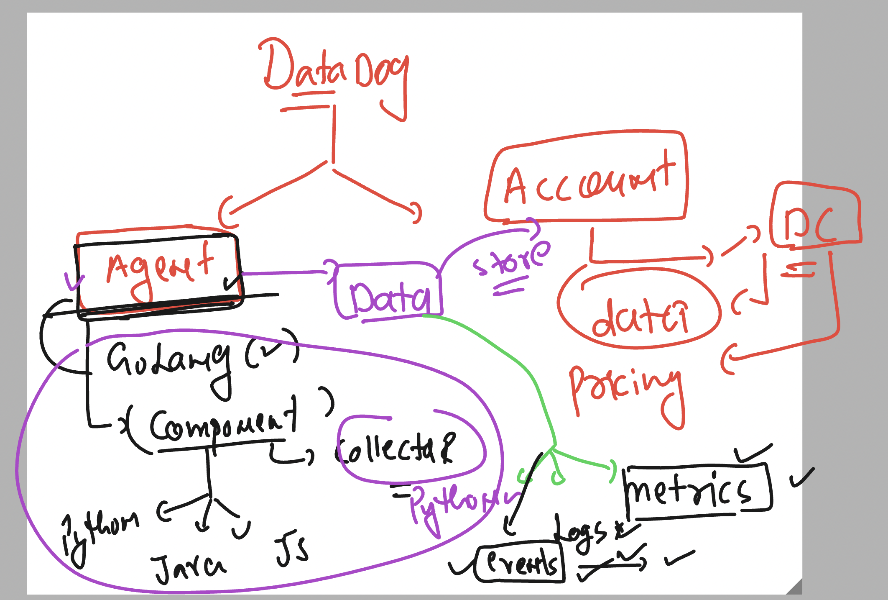
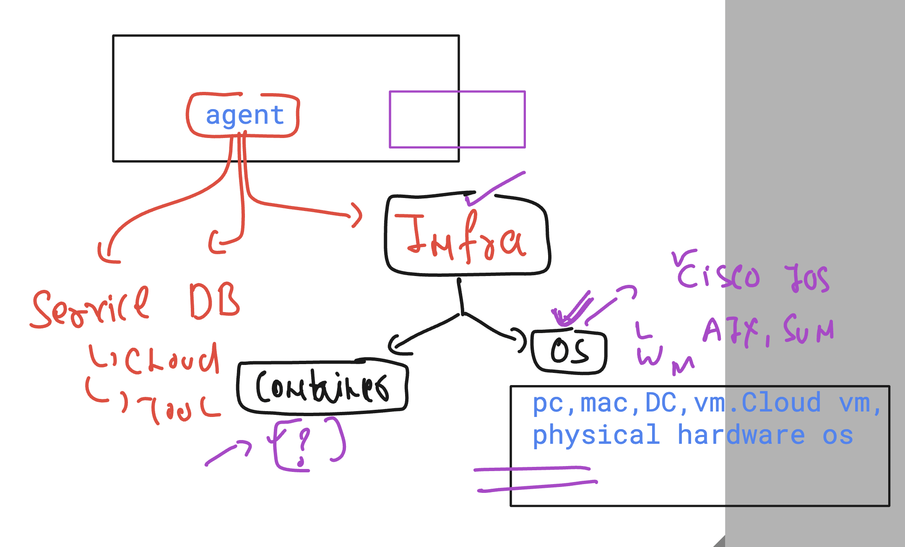
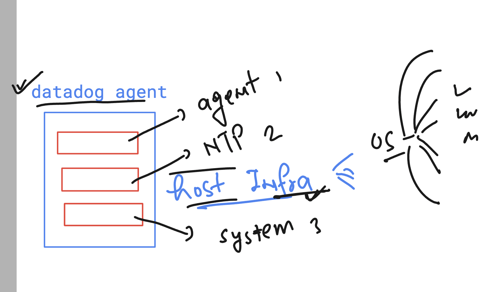

### datadog data collection and retention periods in data types 


### datadog agent is module based system 



### checking datadog status in linux infra 

```
ec2-user@ip-172-31-36-157 ~]$ whoami
ec2-user
[ec2-user@ip-172-31-36-157 ~]$ 
[ec2-user@ip-172-31-36-157 ~]$ sudo -i
[root@ip-172-31-36-157 ~]# whoami
root
[root@ip-172-31-36-157 ~]# systemctl status datadog-agent
● datadog-agent.service - Datadog Agent
     Loaded: loaded (/usr/lib/systemd/system/datadog-agent.service; enabled; preset: disabled)
     Active: active (running) since Thu 2024-10-17 12:46:41 UTC; 1min 38s ago
   Main PID: 2067 (agent)
      Tasks: 8 (limit: 4658)

```

### datadog agent Host infra -- default components 



### INstalling docker in linux vm 

```
yum install docker -y 

===> 
systemctl  start docker 
systemctl  status docker 

```
