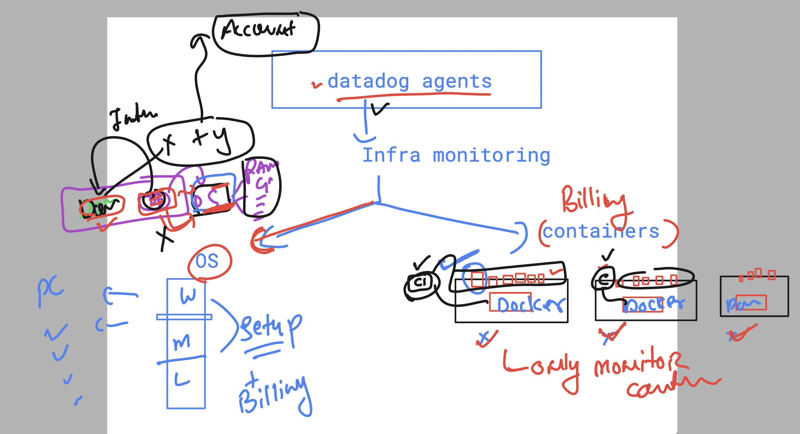
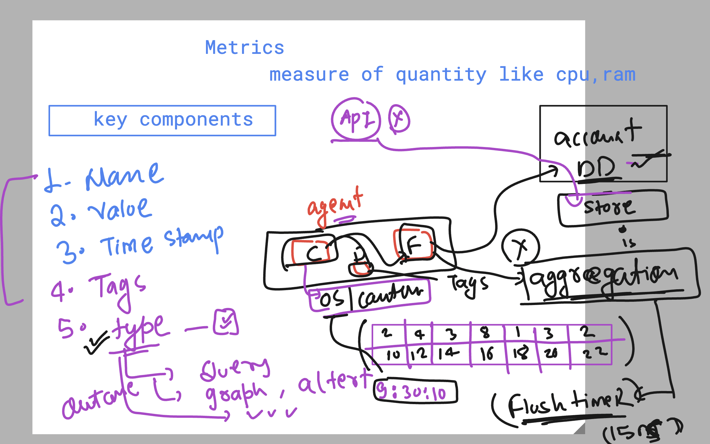
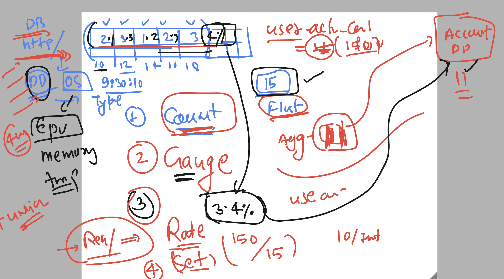

### datadog  revision 


### datadog certifications 

[click_here](https://www.datadoghq.com/certification/overview/)

### checking docker and datadog agent status

```
systemctl status datadog-agent
● datadog-agent.service - Datadog Agent
     Loaded: loaded (/usr/lib/systemd/system/datadog-agent.service; enabled; preset: disabled)
     Active: active (running) since Fri 2024-10-18 12:39:46 UTC; 1min 46s ago
   Main PID: 2083 (agent)
      Tasks: 8 (limit: 4658)
     Memory: 275.9M

===>
systemctl status docker

```

### datadog agent as container 



### running datadog agent as container 

```
docker run -d --name dd-agent \
-e DD_API_KEY="put_your_apikey" \
-e DD_SITE="us5.datadoghq.com" \
-v /var/run/docker.sock:/var/run/docker.sock:ro \
-v /proc/:/host/proc/:ro \
-v /sys/fs/cgroup/:/host/sys/fs/cgroup:ro \
-v /var/lib/docker/containers:/var/lib/docker/containers:ro \
    --restart always   -v /etc/passwd:/etc/passwd:ro -e DD_PROCESS_CONFIG_PROCESS_COLLECTION_ENABLED=true  gcr.io/datadoghq/agent:7
```

### container creating 

```
docker run -itd --name ashuappnewc11  -p 1234:80 nginx 

```

## not all the metrics being send to DD account 

### after flush temer and aggregation process



### metrics type understanding 



