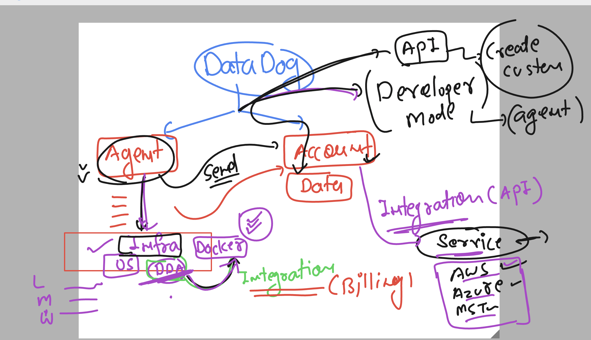

### datadog  revision 



### datadog certifications 

[click_here](https://www.datadoghq.com/certification/overview/)

### checking docker and datadog agent status

```
systemctl status datadog-agent
● datadog-agent.service - Datadog Agent
     Loaded: loaded (/usr/lib/systemd/system/datadog-agent.service; enabled; preset: disabled)
     Active: active (running) since Fri 2024-10-18 12:39:46 UTC; 1min 46s ago
   Main PID: 2083 (agent)
      Tasks: 8 (limit: 4658)
     Memory: 275.9M

===>
systemctl status docker

```

