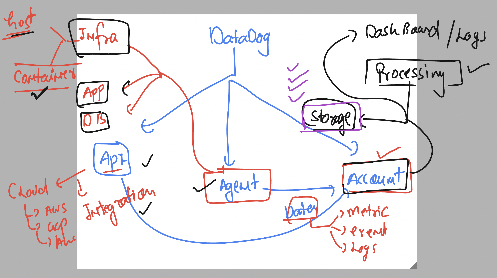
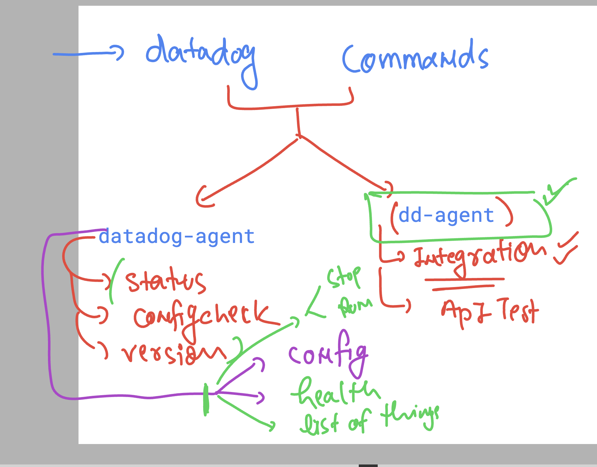
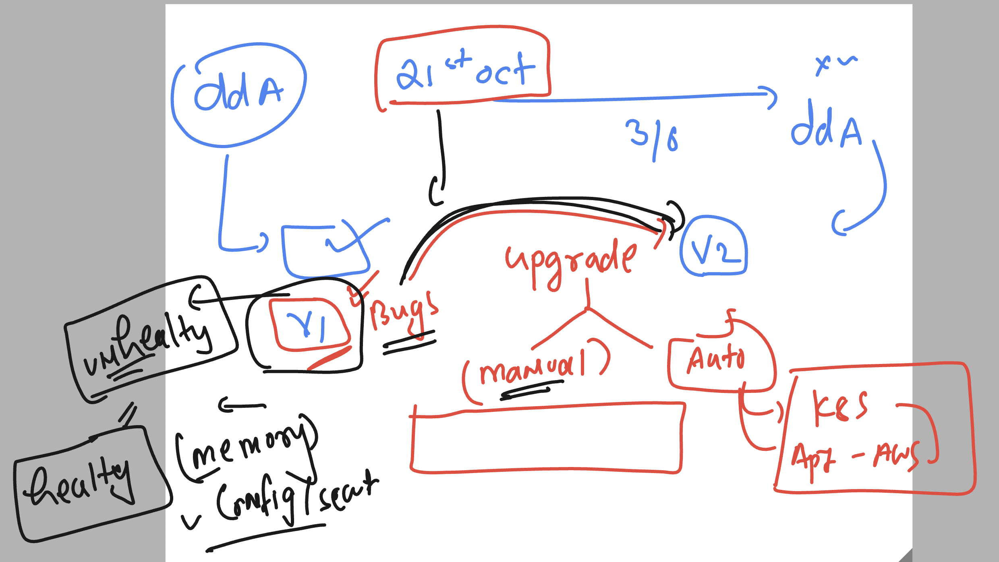

## Revision 



### to change flush interval time in seconds 

```
#dogstatsd:
#  flush_interval: 15

```


### checking datadog status

```
[ec2-user@ip-172-31-36-157 ~]$ sudo -i
[root@ip-172-31-36-157 ~]# systemctl  status datadog-agent
● datadog-agent.service - Datadog Agent
     Loaded: loaded (/usr/lib/systemd/system/datadog-agent.service; enabled; preset: disabled)
     Active: active (running) since Mon 2024-10-21 12:36:17 UTC; 4min 8s ago
   Main PID: 2067 (agent)
      Tasks: 9 (limit: 4658)
     Memory: 274.1M
```

### datadog agent commands 



### datadog other commands 

```
datadog-agent 

The Datadog Agent faithfully collects events and metrics and brings them
to Datadog on your behalf so that you can do something useful with your
monitoring and performance data.

Usage:
  datadog-agent [command]

Available Commands:
  check                 Run the specified check
  completion            Generate the autocompletion script for the specified shell
  config                Print the runtime configuration of a running agent
  configcheck           Print all configurations loaded & resolved of a running agent
  diagnose              Validate Agent installation, configuration and environment
  dogstatsd             Inspect dogstatsd pipeline status
  dogstatsd-capture     Start a dogstatsd UDS traffic capture
  dogstatsd-replay      Replay dogstatsd traffic
  dogstatsd-stats       Print basic statistics on the metrics processed by dogstatsd
  flare                 Collect a flare and send it to Datadog
  health                Print the current agent health
  help                  Help about any command
  hostname              Print the hostname used by the Agent
  import                Import and convert configuration files from previous versions of the Agent
  integration           Datadog integration manager
  jmx                   Run troubleshooting commands on JMXFetch integrations
  launch-gui            starts the Datadog Agent GUI
  processchecks         Run a specific check and print the results. Choose from: process, rtprocess, container, rtcontainer, process_discovery
  run                   Run the Agent
  secret                Display information about secrets in configuration.
```

### to check datadog running config files or currently loaded datadog config details 

```
root@ip-172-31-36-157 conf.d]# datadog-agent config  

```

### datadog agent health check 



```
datadog-agent health 
Agent health: PASS
=== 15 healthy components ===
ad-config-provider-kubernetes-container-allinone, ad-containerlistener, ad-servicelistening, aggregator, collector-queue-15s, collector-queue-900s, dogstatsd-main, forwarder, healthcheck, healthcheck, tagger-store, tagger-workloadmeta, workloadmeta-docker, workloadmeta-puller, workloadmeta-store
[root@ip-172-31-36-157 conf.d]# 

```