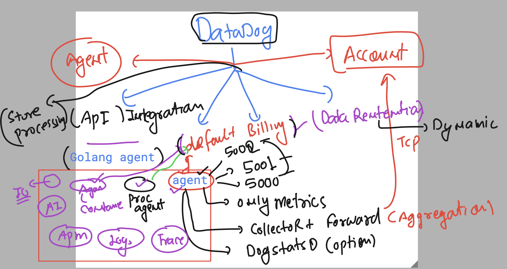

### Datadog -- Things to Remember 



### datadog observations on non app server based webapps 


### Logging options 


### check httpd app server status

```
ec2-user@ip-172-31-36-157 ~]$ sudo   -i
[root@ip-172-31-36-157 ~]# 
[root@ip-172-31-36-157 ~]# whoami
root
[root@ip-172-31-36-157 ~]# 
[root@ip-172-31-36-157 ~]# systemctl status  httpd
○ httpd.service - The Apache HTTP Server
     Loaded: loaded (/usr/lib/systemd/system/httpd.service; disabled; preset: disabled)
     Active: inactive (dead)
       Docs: man:httpd.service(8)
[root@ip-172-31-36-157 ~]# systemctl start  httpd

===>> making enable on boot 
[root@ip-172-31-36-157 ~]# systemctl enable   httpd
Created symlink /etc/systemd/system/multi-user.target.wants/httpd.service → /usr/lib/systemd/system/httpd.service.

===>
[root@ip-172-31-36-157 ~]# systemctl status  httpd
● httpd.service - The Apache HTTP Server
     Loaded: loaded (/usr/lib/systemd/system/httpd.service; enabled; preset: disabled)
     Active: active (running) since Tue 2024-10-22 12:37:34 UTC; 13s ago
       Docs: man:httpd.service(8)
   Main PID: 3178 (httpd)
     Status: "Total requests: 0; Idle/Busy workers 100/0;Requests/sec: 0; Bytes served/sec:   0 B/sec"
      Tasks: 177 (limit: 4658)
```

### log location of httpd server

```
root@ip-172-31-36-157 ~]# cd  /var/log/httpd/
[root@ip-172-31-36-157 httpd]# ls
access_log  error_log
[root@ip-172-31-36-157 httpd]# 


```

### datadog as logging solution 


### datadog store logs in Indexed format (db table format schema)


### enable datadog for apache httpd 

### change ing datadog.yaml file 
```
logs_enabled: true
```

### enable apache integration 

```
nano /etc/datadog-agent/conf.d/apache.d/ashu_httpd.yaml

===>
#Log section
logs:

    # - type : (mandatory) type of log input source (tcp / udp / file)
    #   port / path : (mandatory) Set port if type is tcp or udp. Set path if type is file
    #   service : (mandatory) name of the service owning the log
    #   source : (mandatory) attribute that defines which integration is sending the log
    #   sourcecategory : (optional) Multiple value attribute. Can be used to refine the source attribute
    #   tags: (optional) add tags to each log collected

  - type: file
    path: /var/log/httpd/access_log
    source: apache
    sourcecategory: http_web_access
    service: ashuservice

  - type: file
    path: /var/log/httpd/error_log
    source: apache
    sourcecategory: http_web_access
    service: ashuservice
```

### set permission 

```
chmod 755 /var/log/httpd
```
### restart service and verify it 

```
systemctl restart datadog-agent 

===>
datadog-agent status  # please check Log-agent section from bottom 

```

### overview of Log enable and integration 


### Understanding the 2 stage of logs management 


## Docker log enable steps

### check docker service 

```
 systemctl  status docker
● docker.service - Docker Application Container Engine
     Loaded: loaded (/usr/lib/systemd/system/docker.service; disabled; preset: disabled)
     Active: active (running) since Tue 2024-10-22 12:36:39 UTC; 2h 18min ago
TriggeredBy: ● docker.socket
       Docs: https://docs.docker.com
   Main PID: 2291 (dockerd)
      Tasks: 9
     Memory: 117.1M
        CPU: 4.001s
     CGroup: /system.slice/docker.servi
```

### datadog agent + docker (integration) -- check please 

### lets enable docker logging -- add in datadog.yaml file 

```
listeners:
  - name: docker
config_providers:
  - name: docker
    polling: true
logs_config:
  container_collect_all: true
```

### overall

```
188  nano  /etc/datadog-agent/datadog.yaml
  189  datadog-agent configcheck 
  190  history 
[root@ip-172-31-36-157 log]# 
[root@ip-172-31-36-157 log]# systemctl restart datadog-agent
[root@ip-172-31-36-157 log]# 

```


### some commands

```
 195  docker run -itd --name xcashu11  alpine 
  196  docker ps
  197  docker logs  newashuc1
  198  docker logs  xcashu11
  199  ping -t 3 www.google.com
  200  ping --help
  201  ping -i 3 www.google.com
  202  docker run -itd --name xcashu22  alpine  ping -i 3 www.google.com 
  203  docker ps
  204  docker logs xcashu22
```

### Understanding alog collect by Datadog from non-std sources 


## create a location where you want to keep your python app + logs 

```
root@ip-172-31-36-157 log]# cd
[root@ip-172-31-36-157 ~]# 
[root@ip-172-31-36-157 ~]# cd /opt/
[root@ip-172-31-36-157 opt]# mkdir   ashu-python-webapp
[root@ip-172-31-36-157 opt]# ls
ashu-python-webapp  aws  containerd  datadog-agent
[root@ip-172-31-36-157 opt]# 
[root@ip-172-31-36-157 opt]# 
[root@ip-172-31-36-157 opt]# cd  ashu-python-webapp/
[root@ip-172-31-36-157 ashu-python-webapp]# ls
[root@ip-172-31-36-157 ashu-python-webapp]# 


===>
nano webapp.py


from flask import Flask, request, jsonify
import logging

app = Flask(__name__)

# Configure logging to a file
logging.basicConfig(filename='app.log', level=logging.INFO,
                    format='%(asctime)s - %(levelname)s - %(message)s')

@app.route('/')
def home():
    app.logger.info('Home page was accessed')
    return "Welcome to the Flask App!"

@app.route('/log', methods=['POST'])
def log_message():
    data = request.json
    message = data.get('message', 'No message provided')
    app.logger.info(f'Log message received: {message}')
    return jsonify({"status": "Message logged"}), 200

if __name__ == '__main__':
    app.run(debug=True,host='0.0.0.0',port=8080)


```

### Install python Flask in your machine and run the code 

```
yum install python3-pip -y 
===>
pip3 install flask 

===> lets run code and check logs 
python3 webapp.py 
```

### checking logs 

```
root@ip-172-31-36-157 ashu-python-webapp]# python3 webapp.py 
 * Serving Flask app 'webapp'
 * Debug mode: on
^C[root@ip-172-31-36-157 ashu-python-webapp]# ls
app.log  webapp.py
[root@ip-172-31-36-157 ashu-python-webapp]# cat app.log 
2024-10-22 15:53:59,191 - INFO - WARNING: This is a development server. Do not use it in a production deployment. Use a production WSGI server instead.
 * Running on all addresses (0.0.0.0)
 * Running on http://127.0.0.1:8080
 * Running on http://172.31.36.157:8080
2024-10-22 15:53:59,191 - INFO - Press CTRL+C to quit
2024-10-22 15:53:59,192 - INFO -  * Restarting with stat
2024-10-22 15:53:59,372 - WARNING -  * Debugger is active!
2024-10-22 15:53:59,373 - INFO -  * Debugger PIN: 815-091-242
2024-10-22 15:54:26,430 - INFO - Home page was accessed
2024-10-22 15:54:26,430 - INFO - 106.219.68.125 - - [22/Oct/2024 15:54:26] "GET / HTTP/1.1" 200 -
2024-10-22 15:54:26,559 - INFO - 106.219.68.125 - - [22/Oct/2024 15:54:26] "GET /favicon.ico HTTP/1.1" 404 -
2024-10-22 15:54:29,385 - INFO - Home page was accessed
2024-10-22 15:54:29,385 - INFO - 106.219.68.125 - - [22/Oct/2024 15:54:29] "GET / HTTP/1.1" 200 -
2024-10-22 15:54:53,650 - INFO - 106.219.68.125 - - [22/Oct/2024 15:54:53] "GET /log HTTP/1.1" 405 -
2024-10-22 15:55:00,072 - INFO - 106.219.68.125 - - [22/Oct/2024 15:55:00] "GET /log HTTP/1.1" 405 -
[root@ip-172-31-36-157 ashu-python-webapp]# 


```
