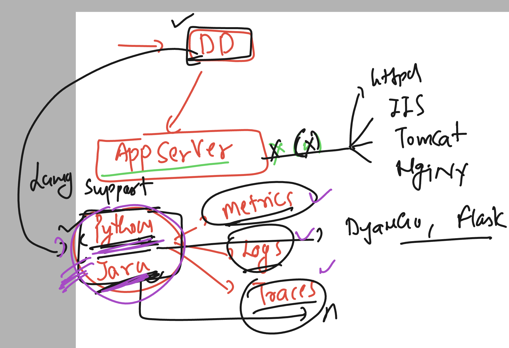

### Datadog -- Things to Remember 


### datadog observations on non app server based webapps 



### Logging options 


### check httpd app server status

```
ec2-user@ip-172-31-36-157 ~]$ sudo   -i
[root@ip-172-31-36-157 ~]# 
[root@ip-172-31-36-157 ~]# whoami
root
[root@ip-172-31-36-157 ~]# 
[root@ip-172-31-36-157 ~]# systemctl status  httpd
○ httpd.service - The Apache HTTP Server
     Loaded: loaded (/usr/lib/systemd/system/httpd.service; disabled; preset: disabled)
     Active: inactive (dead)
       Docs: man:httpd.service(8)
[root@ip-172-31-36-157 ~]# systemctl start  httpd

===>> making enable on boot 
[root@ip-172-31-36-157 ~]# systemctl enable   httpd
Created symlink /etc/systemd/system/multi-user.target.wants/httpd.service → /usr/lib/systemd/system/httpd.service.

===>
[root@ip-172-31-36-157 ~]# systemctl status  httpd
● httpd.service - The Apache HTTP Server
     Loaded: loaded (/usr/lib/systemd/system/httpd.service; enabled; preset: disabled)
     Active: active (running) since Tue 2024-10-22 12:37:34 UTC; 13s ago
       Docs: man:httpd.service(8)
   Main PID: 3178 (httpd)
     Status: "Total requests: 0; Idle/Busy workers 100/0;Requests/sec: 0; Bytes served/sec:   0 B/sec"
      Tasks: 177 (limit: 4658)
```

### log location of httpd server

```
root@ip-172-31-36-157 ~]# cd  /var/log/httpd/
[root@ip-172-31-36-157 httpd]# ls
access_log  error_log
[root@ip-172-31-36-157 httpd]# 


```