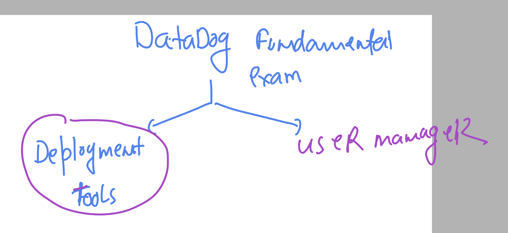
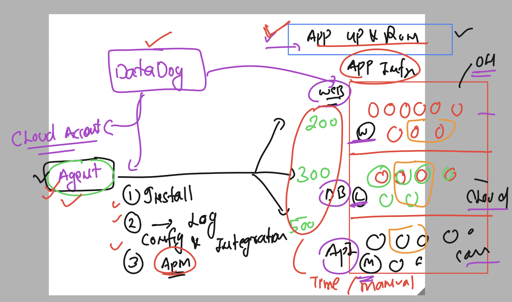
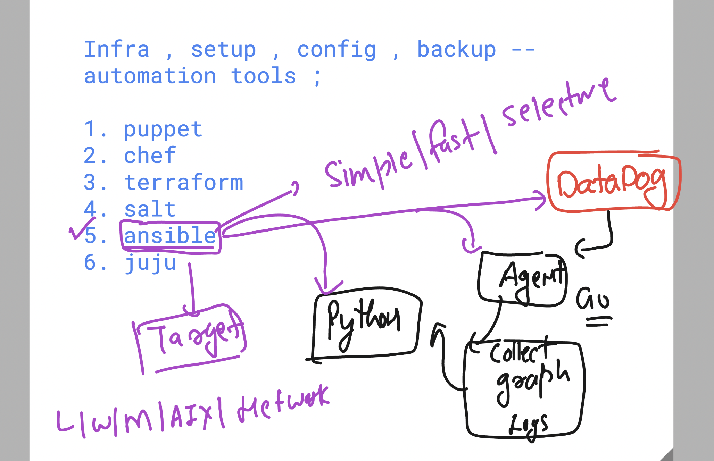
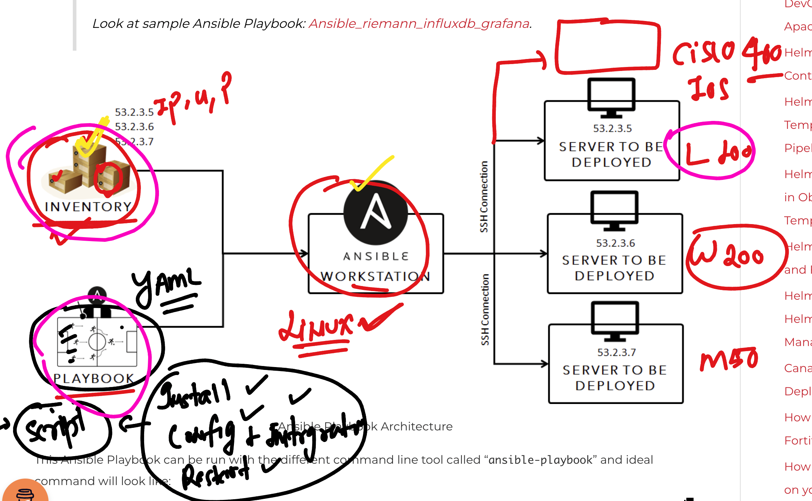
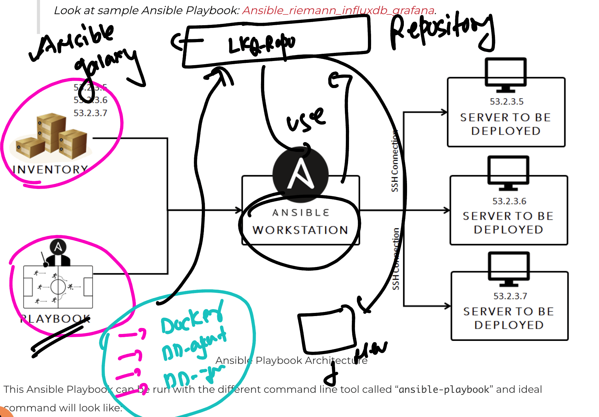

### Datadog new discussion 

### datadog multi agent installation 

### to install and configure datadog agent on various host -- ANsible 

### Info about ANsible architecture and components

## final ansible info 

### ansible galaxy 

### ansible connection types 

