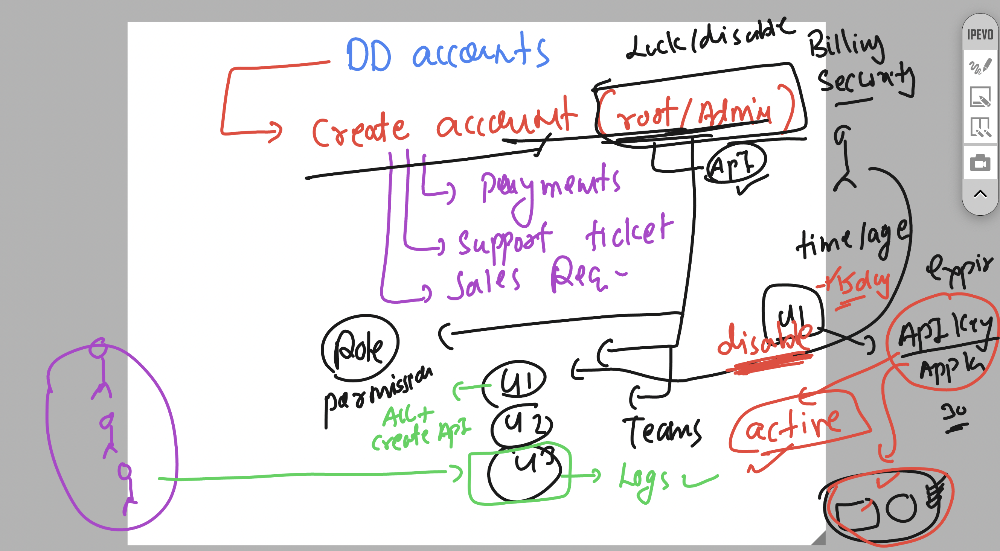

### Datadog new discussion 


### datadog multi agent installation 


### to install and configure datadog agent on various host -- ANsible 


### Info about ANsible architecture and components


## final ansible info 

### ansible galaxy 


### ansible connection types 


### datadog accounts info 


### account disable & api Key behaviour



### checking my datadog agent

```
datadog-agent  hostname 
ip-172-31-36-157.ap-south-1.compute.internal
[root@ip-172-31-36-157 ~]# 
[root@ip-172-31-36-157 ~]# 
[root@ip-172-31-36-157 ~]# systemctl restart datadog-agent
[root@ip-172-31-36-157 ~]# 
[root@ip-172-31-36-157 ~]# systemctl status datadog-agent
● datadog-agent.service - Datadog Agent
     Loaded: loaded (/usr/lib/systemd/system/datadog-agent.service; enabled; preset: disabled)
     Active: active (running) since Wed 2024-10-23 13:06:21 UTC; 6s ago
   Main PID: 3666 (agent)
      Tasks: 8 (limit: 4658)
     Memory: 87.1M

```

## for APM 


## Deploy flask webapp 

### clone the code from github 

```
yum install git -y 

===> clone repo 

cd /opt/
[root@ip-172-31-36-157 opt]# ls
ashu-python-webapp  aws  containerd  datadog-agent
[root@ip-172-31-36-157 opt]# 
[root@ip-172-31-36-157 opt]# 
[root@ip-172-31-36-157 opt]# 
[root@ip-172-31-36-157 opt]# git  clone https://github.com/redashu/resources.git
Cloning into 'resources'...
remote: Enumerating objects: 470, done.
remote: Counting objects: 100% (470/470), done.
remote: Compressing objects: 100% (325/325), done.
remote: Total 470 (delta 130), reused 398 (delta 80), pack-reused 0 (from 0)
Receiving objects: 100% (470/470), 6.62 MiB | 23.36 MiB/s, done.
Resolving deltas: 100% (130/130), done.
[root@ip-172-31-36-157 opt]# ls
ashu-python-webapp  aws  containerd  datadog-agent  resources
[root@ip-172-31-36-157 opt]# 


```

### copy code to current directory and go there 

```
 ls
ashu-python-webapp  aws  containerd  datadog-agent  resources
[root@ip-172-31-36-157 opt]# cp -rf resources/webappss/python-flask-weathermap/   .
[root@ip-172-31-36-157 opt]# ls
ashu-python-webapp  aws  containerd  datadog-agent  python-flask-weathermap  resources
[root@ip-172-31-36-157 opt]# 
[root@ip-172-31-36-157 opt]# 
[root@ip-172-31-36-157 opt]# cd python-flask-weathermap/
[root@ip-172-31-36-157 python-flask-weathermap]# ls
env_var.bat  requirements.txt  templates  weather_1.py
[root@ip-172-31-36-157 python-flask-weathermap]# 

```

### Installing python flask to run app 

```
yum install python3-pip -y 

===>
root@ip-172-31-36-157 python-flask-weathermap]# ls
env_var.bat  requirements.txt  templates  weather_1.py
[root@ip-172-31-36-157 python-flask-weathermap]# pip install -r requirements.txt 
Collecting attrs==22.1.0
  Downloading attrs-22.1.0-py2.py3-none-any.whl (58 kB)
     |████████████████████████████████| 58 kB 2.9 MB/s             
Collecting bytecode==0.13.0
  Downloading bytecode-0.13.0-py3-none-any.whl (53 kB)
     |████████████████████████████████| 53 kB 3.7 MB/s             
Collecting cattrs==22.2.0

```